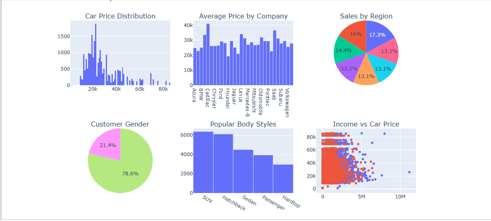
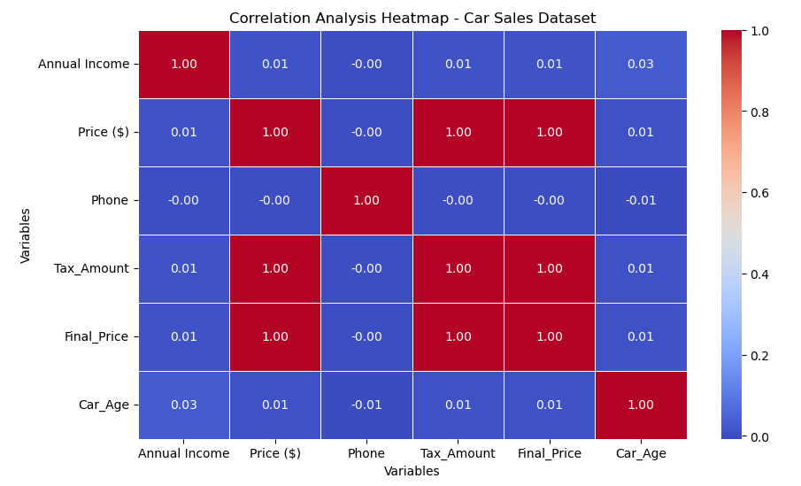

# Car_Sales_Analysis_Python.
Python-based car sales data analysis project covering data cleaning, visualization and insight generalization.

## Project Overview

This project involves exploratory data analysis (EDA) of a Car Sales dataset using Python.

The aim of the analysis is to clean the dataset, explore sales patterns, generate insights, and understand factors that influence car pricing and customer behaviour.

## Dashboard Preview

## Heatmap Preview

## Tools Used

- Python
- Pandas
- NumPy
- Matplotlib
- Seaborn
- Jupyter Notebook

## Data Cleaning

The following preprocessing steps were performed:

- Checked dataset structure and data types
- Identified and handled missing values
- Removed duplicate records
- Prepared data for analysis

## Analysis Performed

The analysis covered:

- Car price distribution
- Sales trends by company and model
- Customer and dealer insights
- Relationship between vehicle features and pricing
- Data visualization to identify patterns

## Feature Engineering

Created additional calculated columns:

- *Tax Amount* – 5% tax calculated from car price
- *Final Price* – price after adding tax
- *Car Age* – calculated from vehicle sale date

## Machine Learning Concepts

Reviewed:

- *Linear Regression* – used for predicting continuous values such as car prices
- *Logistic Regression* – used for classification tasks such as purchase prediction

## Key Insights

The analysis helps understand:

- Pricing patterns across different car brands
- Customer purchasing behaviour
- Dealer performance
- Factors affecting vehicle prices

## Conclusion

This project demonstrates how Python data analysis techniques can transform raw car sales data into meaningful business insights that support pricing decisions, inventory planning, and customer targeting.
